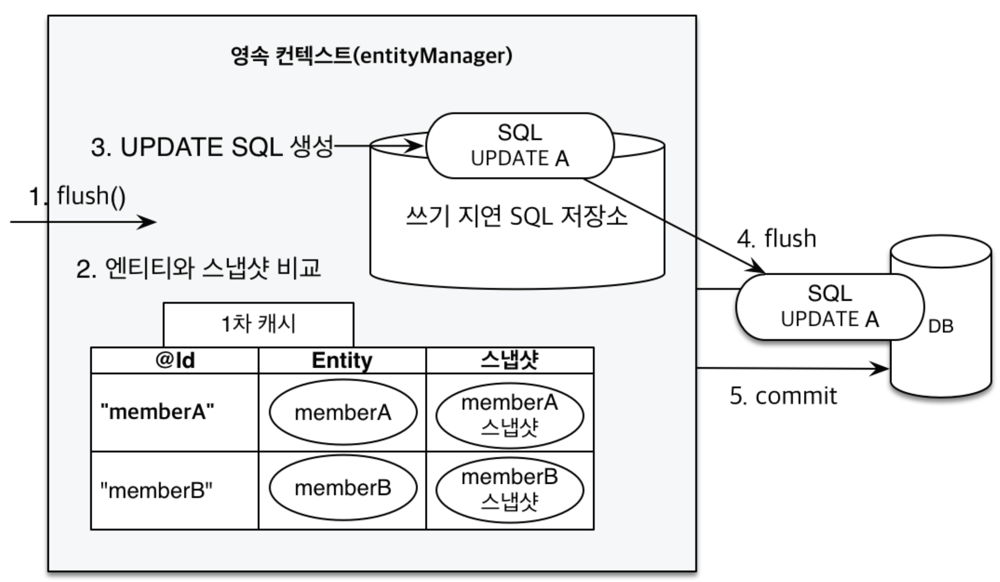

# 섹션 3. 영속성 관리 - 내부 동작 방식

## 영속성 컨텍스트란?

* JPA를 이해하는데 가장 중요한 용어
* **엔티티를 영구 저장하는 환경** 이라는 뜻
* 엔티티 매니저를 통해서 영속성 컨텍스트에 접근

<figure><figcaption></figcaption></figure>

## 엔티티의 생명주기

* 비영속 (new/transient): 영속선 컨텍스트와 전혀 관계가 없는 새로운 상태
* 영속 (managed): 영속성 컨텍스트에 관리되는 상태
* 준영속 (detached): 영속성 컨텍스트에 저장되었다가 분리된 상태
* 삭제 (removed): 삭제된 상태

#### 비영속

객체를 생성한 상태

```java
Member member = new Member();
member.setId("member1");
member.setUsername("회원1");
```

#### 영속

엔티티 매니저를 통해 영속성 컨텍스트에 저장한 상태

```java
em.persist(member);
```

#### 준영속

영속성 컨텍스트가 더이상 관리하지 않는 상태

```java
em.detach(member); // 특정 엔티티만 준영속 상태로 전환
em.clear() // 영속성 컨텍스트를 완전히 초기화
em.close() // 영속성 컨텍스트를 종료
```


hibernate 5.4.1.Final 버전부터 `em.close()`를 해도 트랜잭션이 유지되고 있으면 영속성 컨텍스트가 유지된다고 한다.

참고 : [https://www.inflearn.com/questions/53733/comment/67403](https://www.inflearn.com/questions/53733/comment/67403)


#### 삭제

영속성 컨텍스트에서 객체를 삭제한 상태

```java
em.remove(member);
```

## 영속성 컨텍스트의 이점

* 1차 캐시
* 동일성(identity) 보장
* 트랜잭션을 지원하는 쓰기 지연
* 변경 감지
* 지연 로딩

#### 1차 캐시

영속성 컨텍스트는 내부에 엔티티를 보관하는 1차 캐시라는걸 들고 있다. 네트워크를 통해 데이터베이스에 접근하는것 보다 서버 메모리에 접근하는 비용이 훨씬 싸기 때문에 1차 캐시를 통해 데이터베이스 접근 횟수를 줄여 성능을 개선할 수 있다. 1차 캐시는 Map의 형태로 @Id(PK)를 key로, 엔티티 객체를 value로 저장한다.

1차 캐시 조회

조회하려는 엔티티가 1차 캐시에 있으면 1차 캐시에서 바로 가져온다.

```java
Member member = new Member();
member.setId("member1");
member.setUsername("회원1");

em.persist(member); //영속화, 1차 캐시에 저장
Member findMember = em.find(Member.class, "member1"); //1차 캐시에서 조회
```

<figure><figcaption></figcaption></figure>

데이터베이스에서 조회

조회하려는 엔티티가 1차 캐시에 없으면 DB에서 조회 후 1차 캐시에 저장한다.

```java
Member findMember2 = em.find(Member.class, "member2");
```

<figure><figcaption></figcaption></figure>

#### 동일성 보장

같은 트랜잭션에서 식별자가 같은 데이터를 조회하면 1차 캐시에서 객체를 반환하기 때문에 두 객체는 동일하다.

```java
Member findMember1 = em.find(Member.class, "member1");
Member findMember2 = em.find(Member.class, "member1");

findMember1 == findMember2   // true
```

#### 트랜잭션을 지원하는 쓰기 지연

엔티티를 영속화한 시점에 데이터베이스에 SQL을 보내지 않고 트랜잭션 커밋 시점에 SQL을 보낸다.

```java
EntityTansaction tx = em.getTransaction();
tx.begin();    // 트랜잭션 시작

em.persist(memberA);    // 1차 캐시에 저장, INSERT SQL 보내지 않음
em.persist(memberB);    // 1차 캐시에 저장, INSERT SQL 보내지 않음

tx.commit();    // 트랜잭션 커밋, 데이터베이스에 INSERT SQL 보냄
```

엔티티를 `em.persist()`로 영속화하면 1차 캐시에 엔티티가 저장되고 INSERT SQL을 생성한 후 쓰기 지연 저장소에 저장한다.

<figure><figcaption></figcaption></figure>

트랜잭션을 커밋할 때 쓰기 지연 저장소에 있는 SQL을 데이터베이스로 보낸다.

<figure><figcaption></figcaption></figure>

#### 변경 감지

JPA는 영속성 컨텍스트의 1차 캐시에 데이터가 처음 저장될 때 스냅샷을 뜬다. 트랜잭션 커밋 시점에 스냅샷과 엔티티의 내용을 비교, 내용이 다르면 UPDATE 쿼리를 날린다.

```java
Member member = em.find(Member.class, "memberA");  // 데이터 조회
member.setUsername("memberAAA"); // 데이터 변경

tx.commit(); // 트랜잭션 커밋, 변경내용 반영
```

<figure><figcaption></figcaption></figure>

데이터를 삭제할 땐 `em.remove()`를 사용하면 트랜잭션 커밋 시점에 delete 쿼리가 나간다.

```java
Member member = em.find(Member.class, "memberA");
em.remove(member);

tx.commit();
```

## 플러시

#### 플러시란?

영속성 컨텍스트의 변경 내용을 데이터베이스에 반영하는 것을 말한다. 플러시가 발생하면 변경 감지가 일어나고, 쓰기 지연 SQL 저장소의 쿼리를 데이터베이스이 전송한다.

영속성 컨텍스트를 플러시하는 방법에는 3가지가 있다.

* `em.flush()` - 직접 호출
* 트랜잭션 커밋 - 플러시 자동 호출
* JPQL 쿼리 실행 - 플러시 자동 호출

#### JPQL 쿼리 실행시 플러시가 자동 호출되는 이유가 뭘까?

`em.persist()`로 엔티티를 영속화 하면 커밋하기 전까지 DB에 반영되지 않는다. 그래서 JPQL로 DB를 조회하게 되면 DB에는 저장된 데이터가 없기 때문에 의도한대로 동작이 안될 수 있다. JPA는 이 문제가 발생하지 않도록 JPQL 쿼리를 실행하면 플러시를 발생해서 의도한대로 동작하도록 한다.

```java
// 1차 캐시 저장, DB 반영 안됨
em.persist(memberA);
em.persist(memberB);

// 플러시 발생 후 DB 조회
List<Member> members = em.createQuery("select m from Member m", Member.class)
        .getResultList();
```

#### 플러시 모드 옵션

* `em.setFlushMode(FlushModeType.COMMIT)`
* `FlushModeType.AUTO` - 커밋이나 쿼리를 실행할 때 플러시 (기본값)
* `FlushModeType.COMMIT` - 커밋할 때만 플러시



#### **플러시 짚고 넘어가기**

* 영속성 컨텍스트를 비우지 않음
* 영속성 컨텍스트의 변경내용을 데이터베이스에 동기화
* 트랜잭션이라는 작업 단위가 중요 -> 커밋 직전에만 동기화 하면 됨

